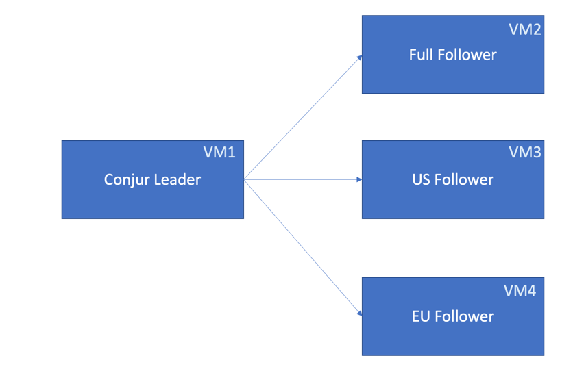

# Demo script for the selective replication

## How replication Sets works ?


## Demo Architecture



## Pre-requisites
- Last version of the conjur binary uploaded to the target servers
- conjur-cli
- docker or podman installed
- Clone this git repository

## Create Conjur Master
- Run:
```shell
./create-leader.sh
```
- Check master health:
```shell
curl -k https://$(hostname -f)/health
```
- Check available replication set:
```shell
podman exec conjur-leader evoke replication-set list
```

## Load sample policy
- Run:
```shell
conjur policy load -b root -f app.yaml
```

## Create the followers replication Sets
- Run:
```shell
podman exec conjur-leader evoke replication-set create us
podman exec conjur-leader evoke replication-set create eu
```
- Check available replication set:
```shell
podman exec conjur-leader evoke replication-set list
```

## Add secrets to replication Sets
- Create the US policy replication Set:
```shell
conjur policy load -b root -f permit-us-replication.yaml
```

- List resources that would replicate the data for us region:

```shell
podman exec conjur-leader bash -c $'
chpst -u conjur psql -c "
SELECT resource_id
FROM resources
WHERE is_role_allowed_to(
\'system:group:conjur/replication-sets/us/replicated-data\',
\'read\',
resource_id
);"
'
```

- Create the EU policy replication Set:
```shell
conjur policy load -b root -f permit-eu-replication.yaml
```

- List resources that would replicate the data for eu region:

```shell
podman exec conjur-leader bash -c $'
chpst -u conjur psql -c "
SELECT resource_id
FROM resources
WHERE is_role_allowed_to(
\'system:group:conjur/replication-sets/eu/replicated-data\',
\'read\',
resource_id
);"
'
```

## Generate the seed files for each follower
- Run in the leader:
```shell
./create-follower-seed-full.sh
./create-follower-seed-us.sh
./create-follower-seed-eu.sh
```

## Deploy the followers
- Run in each follower node:
```shell
./create-follower.sh
./install-follower.sh
```

## Check the replicated secrets 
- Run in FULL follower node:
```shell
./init-conjur-cli.sh
conjur list --kind variable
```

- Run in US follower node:
```shell
./init-conjur-cli.sh
conjur list --kind variable
```

- Run in EU follower node:
```shell
./init-conjur-cli.sh
conjur list --kind variable
```